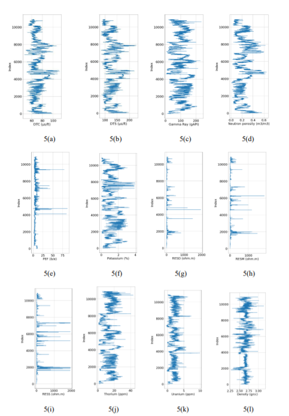
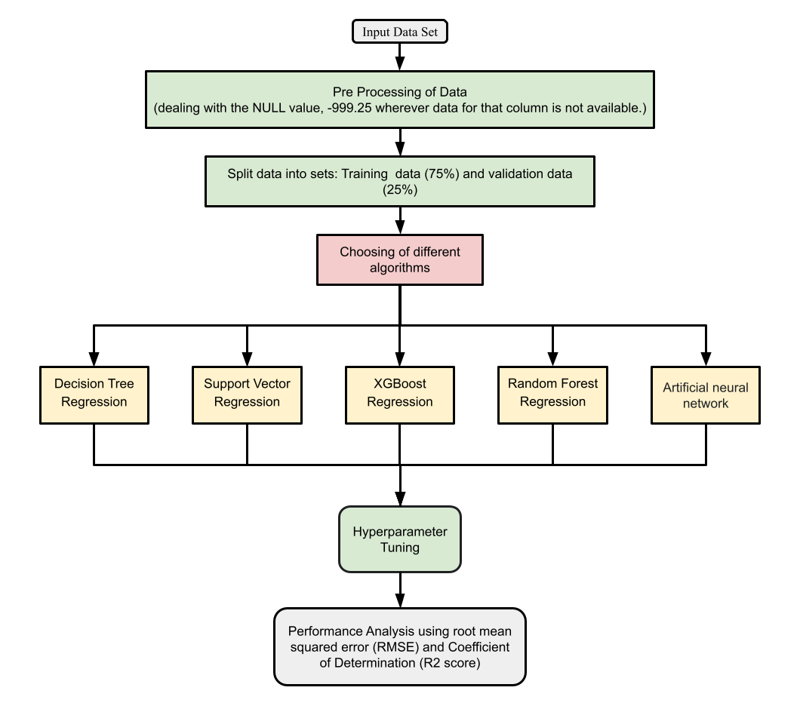

# Augmenting and Eliminating the Use of Sonic Logs Using ML: A Comparative Evaluation

Five artificial intelligence models (Artificial neural network, Support Vector Regression,Decision tree regression, Random forest regression, and XG Boost) were developed and used to estimate the sonic log transit times using other logs.  The models were trained and testedusing more than ten thousand data points.  Present work efficiently predicts the sonic log transit time using other logs using Artificial Intelligence.  Artificial intelligence provides a costeffective way to predict sonic transit times in the absence of actual data. This application augments the cases of missing or unreliable sonic logging data. In cases of unavailability of both DTC and DTS, AI techniques can still predict them satisfactorily. XGBoost and the random forest technique resulted in the most accurate predictions with an R2 of 0.97 each when DTC was available. If both DTC and DTS need to be predicted, the R2 of both the techniques for DTC came out to be 0.94 and for DTS, 0.95. The correlation of the combined input data was higher with DTS than with DTC. XGBoost and the random forest regression technique outperform all for sonic log prediction purposes. It is an efficientestimation method compared to empirical correlations

